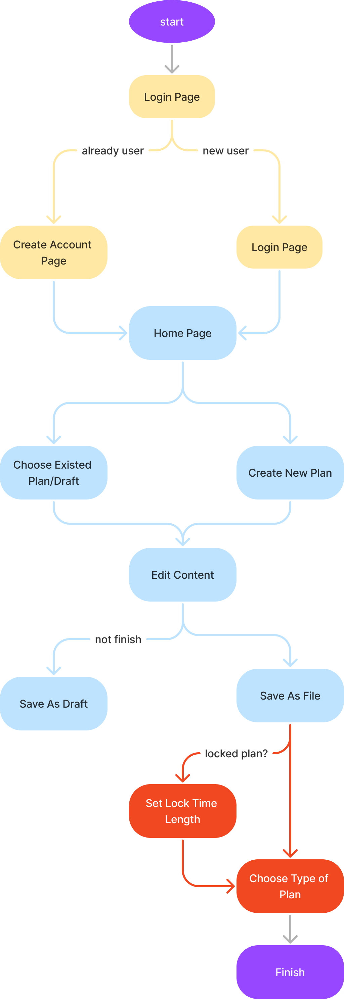
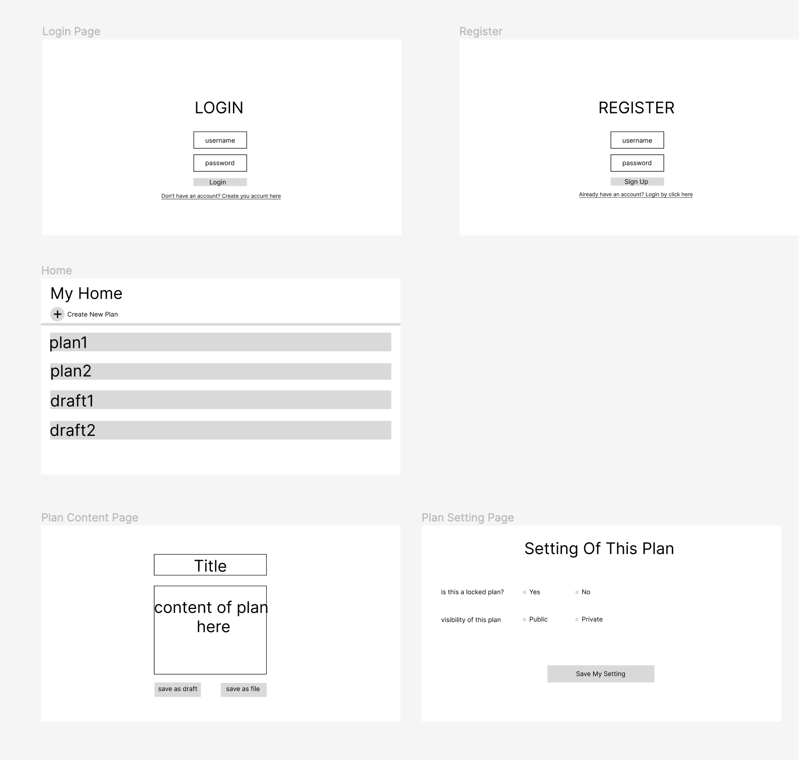

[](https://github.com/software-students-fall2023/5-final-project-projectfive/actions/workflows/ci-cd.yml)

# Final Project

An exercise to put to practice software development teamwork, subsystem communication, containers, deployment, and CI/CD pipelines. See [instructions](./instructions.md) for details.

## Product Vision Statement

"Time Capsule Planner" is a web platform for sending time-locked letters and to-do lists to one's future self, fostering goal-setting, self-reflection, and personal growth.

## User Requirements

1. As a user, I want to create and manage an account, so that I can have a personalized and secure space for my letters and to-do lists.
2. As a user, I want the option to share my achieved goals on public community, so that I can share my progress and successes with others.
3. As a user, I want to have some default options for time length, so that I can only click on the options to set time length to save time.
4. As a user, I want to customize the timelength to lock the letter, so that it will be more flexible for me to plan.
5. As a user, I want to save my plan as scratch, so that I can edit it before I confirm it's complete.
6. As a user, I want my letters and to-do lists to remain securely locked until the set time after I complete them, so that I can enjoy the surprise and authenticity of my past thoughts and goals.
7. As a user, I want to be notified when my time-locked content is available, so that I can revisit my past goals and reflections on time.


## Activity Diagrams

User Story: As a user, I want to create my plan and choose a lock-time for it. Click [here](https://www.figma.com/file/jObJNtRMUtEGZ2nEOu7YKZ/Untitled?type=whiteboard&node-id=0%3A1&t=Rv5uJE4r7lR67agX-1) or the diagram below to view it on figma.


## Wireframe Diagrams

Below is a picture of the wireframe diagrams of every screen in our app. Click [here](https://www.figma.com/proto/J3WIIo7courXKwNBWJeuHD/Untitled?type=design&node-id=1-2&t=PKug5RRITqWffG9p-1&scaling=min-zoom&page-id=0%3A1&starting-point-node-id=1%3A2&mode=design) or the picture to view it on figma.



## Containers

https://hub.docker.com/repository/docker/projectfive/app/general  
https://hub.docker.com/repository/docker/projectfive/notifier/general

The latest images from `main` are tagged with `latest`.

The latest images from all other `branch_name` are tagged with `latest.branch_name`.

All images are also tagged with a UNIX timestamp and the commit hash which triggered the build.

## Team Members

[Michael Lin <mal9608@nyu.edu>](https://github.com/freerainboxbox)  
[Erick Cho <ec3566@nyu.edu>](https://github.com/ec3566)  
[Juliann Zhou <kyz224@nyu.edu>](https://github.com/juliannzhou)  
[Fuzhen Li <fl2097@nyu.edu>](https://github.com/fzfzlfz)

## Getting Started

You can access this project on the Internet from [here](https://projectfive.duckdns.org).

By default, this project runs on port 80. It is advised that you switch to a deployment-ready WSGI server, and optionally, use your own SSL certificates served by an NGINX reverse proxy.

Docker is required to launch the project directly.

To setup the project locally, download `compose.yaml` make a directory called `mongodb-data`, and populate a `.env` with the following values:

`MONGO_USERNAME`: Anything you want.  
`MONGO_PASSWORD`: Prefer a long random string.  
`DEBUG`: Should be set to `False` unless you're developing.  
`FLASK_SECRET_KEY`: Use the following one-liner in Python to generate a 32 byte base64-encoded secret:

```
import secrets, base64; print(base64.b64encode(secrets.token_bytes(32)).decode())
```

To launch on localhost:80, run `docker compose --env-file=".env" up -d`.

To stop the project (and delete all containers), run `docker compose down`.

To update the project to new images, run `docker compose pull`.

To nuke the database (e.g. you forgot a password, or want a clean state): `rm -rf mongodb-data && mkdir mongodb-data`
